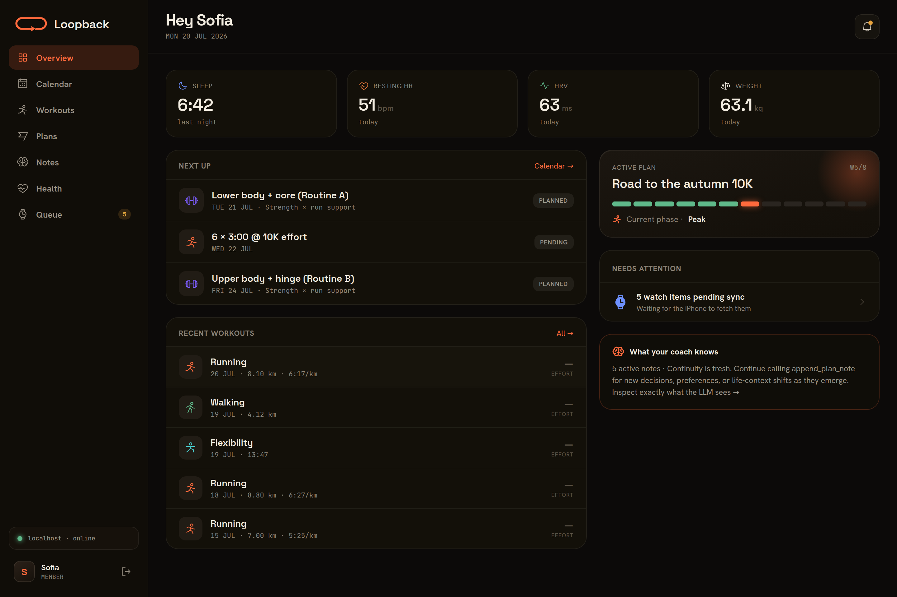
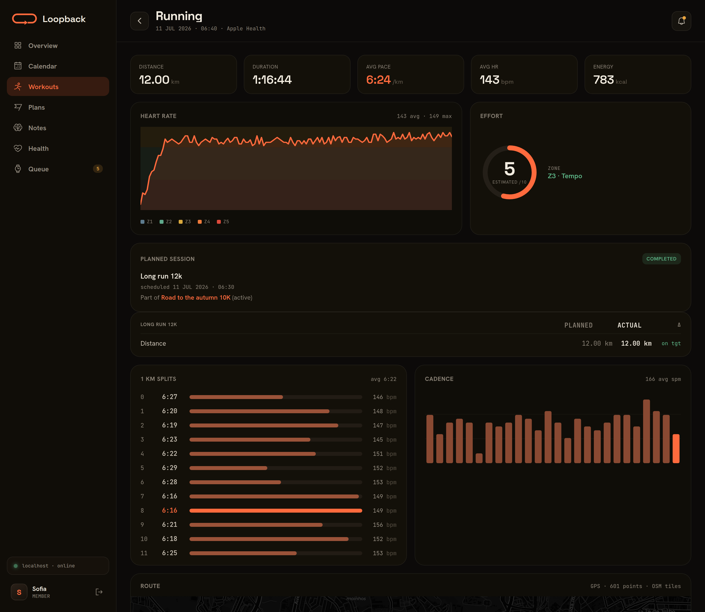
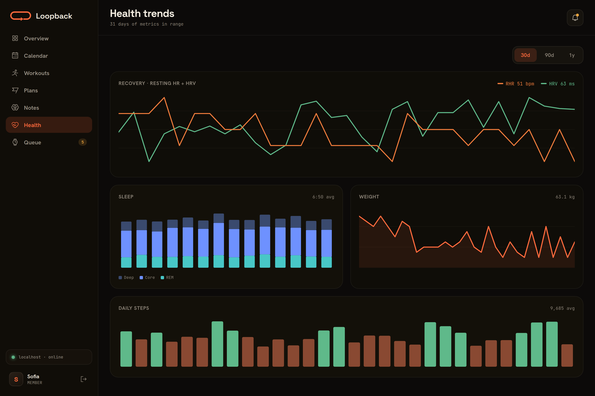

# Loopback Server

[](https://github.com/aderaaij/loopback-training-server/actions/workflows/ci.yml)
[](https://github.com/aderaaij/loopback-training-server/actions/workflows/docker-publish.yml)

The self-hosted backend behind **Loopback – Run Coach**, an iOS running app. It stores workout history, queues structured workouts for delivery to Apple Watch via WorkoutKit, manages training plans and daily health metrics, and serves an authenticated web dashboard for athletes and admins.

Built with FastAPI, PostgreSQL, SQLAlchemy, and React. Includes an optional MCP (Model Context Protocol) server so an AI assistant can act as your running coach over the same data.

> **This is the server half of a two-part system — you also need the [Loopback iOS app](https://github.com/aderaaij/loopback-training-app).** The app is what feeds the server: it syncs Apple HealthKit workouts and daily health metrics to it, and installs queued workouts on Apple Watch. The server runs fine on its own (API, dashboard, MCP), but without the app nothing puts data in or gets workouts onto your watch.

> **Naming note:** this is the companion server for the Loopback running app — no relation to the [LoopBack](https://loopback.io) Node.js framework or Rogue Amoeba's Loopback audio tool. The technical name used throughout the codebase (packages, containers, DB) is `training-api`.



| Workout detail | Health trends |
|---|---|
|  |  |

*Demo data shown; every screen is scoped to the signed-in athlete.*

## Features

- **Workout storage** — CRUD API for workouts with activity type, distance, duration, heart rate, splits, and arbitrary JSONB data
- **Analytics** — Summary endpoints with aggregation by week, month, or year
- **Training queue** — Queue structured workouts (intervals, warmup/cooldown, pace alerts) for sync to Apple Watch via an iOS companion app
- **Workout actions** — Edit or delete workouts already synced to Apple Watch via pending action queue
- **Device inventory** — Track what workouts are currently on the user's Apple Watch
- **Missed workout feedback** — Record and query feedback when users miss scheduled workouts, with pattern detection for coaching
- **Training plans** — Create and manage training plans with goals, guardrails, phases, and athlete context stored as flexible JSONB metadata, plus an explicit completion flow (rating + feedback fed back to the coaching context)
- **Scheduling & calendar** — Attach a recurring weekly cadence to a plan and query a unified calendar that merges queued runs with scheduled strength sessions, flagging conflicts
- **Plan validation** — A deterministic "linter" for upcoming schedules: weekly-ramp and taper checks, missing down weeks, back-to-back hard days, guardrail breaches, strength-day collisions — warnings, never blocks (`POST /api/plans/{id}/validate`, also returned when queueing)
- **Health metrics** — Bulk upsert daily HealthKit metrics (sleep, HR, HRV, weight, VO2Max, steps, body composition) with date-based upsert
- **Plan-workout linking** — Link queued workouts to plans (`plan_id`) and recorded workouts to their planned counterpart (`plan_workout_id`) for planned-vs-actual analysis
- **Multi-user** — Username/password accounts with per-device API tokens (`POST /api/auth/login`); all data is scoped per user
- **Web dashboard** — Authenticated React SPA served same-origin by the API: overview, calendar, workouts, plans, health charts, and queue for athletes; user management and system monitoring for admins
- **Admin & monitoring** — Per-user token inspection/revoke (cut off one stolen device), sync-freshness per athlete, an auth audit trail (logins, password/token/user changes), and a system screen reporting DB size and backup freshness
- **MCP server** — Let AI assistants query your training data, create workouts and plans, and correlate health metrics via natural language

## Quick Start

### Prerequisites

- Docker with Docker Compose v2.24 or newer

### 1. Clone and configure

```bash
git clone https://github.com/aderaaij/loopback-training-server.git
cd loopback-training-server
cp .env.example .env
```

Edit `.env` and set `BOOTSTRAP_ADMIN_PASSWORD` — the password for the first-run `admin` account. Everything else has a sensible default (the comments in the file explain each one).

### 2. Start

```bash
docker compose up -d      # or: make up
```

The first start pulls a prebuilt multi-arch image from GHCR (amd64/arm64; if the pull fails it builds from source instead, which takes a few minutes — `docker compose build` forces that), runs the database migrations, and creates the `admin` account. The API and dashboard are then at `http://localhost:8001` (verify with `curl http://localhost:8001/api/health`).

### 3. Log in

Open `http://localhost:8001` and sign in as `admin` with the password you set. Admins get the management console (Users + System); regular accounts get the training dashboard.

If you left `BOOTSTRAP_ADMIN_PASSWORD` empty, logging in stays disabled and the container log tells you how to fix it (`docker compose logs app`).

### 4. Add your household

One instance serves a household, Audiobookshelf-style: a handful of accounts, all data scoped per user, and no open registration — the admin creates every account.

1. As `admin`, open **Users** and create an account for each athlete (role `user`).
2. Each athlete signs into the **dashboard** with their username + password.
3. In the **[iOS app](https://github.com/aderaaij/loopback-training-app)**, each athlete enters the server URL plus their username + password; the app logs in and stores a per-device token.
4. Optional AI-coach access: each athlete mints a token in the dashboard (**Settings → Create token**) for their own MCP client (see [MCP Server](#mcp-server-optional)).

Passwords, per-device tokens (revoke one stolen device without touching the rest), and deactivation are all managed in the dashboard. The same operations exist as a CLI fallback:

```bash
docker compose exec app python -m app.cli --help
```

## Exposing the server

The iOS app and dashboard just need to reach port 8001 — over HTTPS, or over HTTP on a network you trust. Options, safest first:

- **Tailscale (recommended):** install Tailscale on the server and each phone; clients use `http://<machine-name>:8001` inside the tailnet and nothing is exposed to the internet. If the app must also work for people outside your tailnet, [Tailscale Funnel](https://tailscale.com/kb/1223/funnel) can publish the port (e.g. `tailscale funnel --bg --https 8443 8001`).
- **Reverse proxy:** put Caddy / nginx / Traefik with a real certificate in front and forward to `127.0.0.1:8001`.
- **LAN only:** fine for trying it out, but the app syncs in the background, so a phone that leaves the house needs one of the options above.

If the server ends up publicly reachable: login is rate-limited (5/min/IP), there is no registration endpoint, and the admin System screen shows an auth audit trail — but public exposure still means **strong passwords on every account**.

## Backups

The Postgres volume is the only state worth backing up. A nightly `pg_dump` on the host is enough:

```bash
# crontab -e
30 3 * * * docker exec postgres__training-api pg_dump -U training-api training-api | gzip > /path/to/backups/training-api-$(date +\%F).sql.gz
```

Point `BACKUP_HOST_DIR` in `.env` at that directory and the admin **System** screen reports backup freshness (green < 26 h old). Restore with `gunzip -c <dump>.sql.gz | docker exec -i postgres__training-api psql -U training-api training-api`.

## Configuration

Everything is configured through environment variables in the root `.env` (read by Docker Compose):

| Variable | Default | Purpose |
|----------|---------|---------|
| `BOOTSTRAP_ADMIN_PASSWORD` | *(unset)* | First-run admin password; applied only while the admin has none, so rotating it later is a no-op |
| `BOOTSTRAP_ADMIN_USERNAME` | `admin` | First-run admin username |
| `POSTGRES_PASSWORD` / `POSTGRES_USER` / `POSTGRES_DB` | `training-api` | Database credentials (not published outside the compose network; also fed to the app as `DATABASE_URL`) |
| `API_PORT` | `8001` | Host port for the API + dashboard |
| `BACKUP_HOST_DIR` | `./backups` | Host directory with `pg_dump` files, mounted read-only for the System screen |

Running the backend outside Docker reads `backend/config/.env` instead (template: `backend/config/.env.example`).

**Upgrading from a pre-auth version:** keep your old `API_KEY` set in `backend/config/.env` — the migration seeds it as a token owned by the admin account, so existing clients keep working while you move them to per-user tokens.

## Web dashboard

The `frontend/` directory holds the React 19 + TypeScript SPA (Vite, TanStack Query, hand-rolled SVG charts, Leaflet route maps). The Docker build bakes `frontend/dist` into the image and FastAPI serves it at `/` with an SPA fallback — same origin, no CORS.

Signing in as a regular user shows the athlete screens (overview, calendar, workouts, plans, notes, health, queue). Admins get a management console instead: **Users** (account CRUD, per-device token revoke, sync freshness) and **System** (backup freshness, DB size, auth activity feed).

```bash
cd frontend
npm run dev        # Vite dev server on :5173, proxies /api → localhost:8001
npx tsc -b         # typecheck
npm run build      # production build (also run inside the Docker build)
```

## API

All endpoints except `/api/health` and `/api/auth/login` require a `Bearer` token in the `Authorization` header. Tokens are issued per device by `POST /api/auth/login` (username + password, rate-limited 5/min/IP); `/api/admin/*` additionally requires the `admin` role.

> **Wire casing:** JSON casing varies by resource — auth, admin, feedback, and calendar are camelCase; workouts, queue, plans, and health metrics are snake_case.

### Auth

| Method | Endpoint | Description |
|--------|----------|-------------|
| `POST` | `/api/auth/login` | Log in, mint a per-device token (bad credentials → 401) |
| `GET` | `/api/auth/me` | Current user + their tokens |
| `POST` | `/api/auth/password` | Change own password (revokes every *other* token) |
| `POST` | `/api/auth/tokens` | Mint a named token (shown once; optional `expiresAt`) |
| `DELETE` | `/api/auth/tokens/{id}` | Revoke one of your own tokens |

### Admin

| Method | Endpoint | Description |
|--------|----------|-------------|
| `GET` | `/api/admin/users` | List users with token stats + sync freshness |
| `POST` | `/api/admin/users` | Create a user |
| `PATCH` | `/api/admin/users/{id}` | Activate/deactivate (deactivation revokes all tokens) |
| `POST` | `/api/admin/users/{id}/password` | Reset a user's password |
| `GET` | `/api/admin/users/{id}/tokens` | List a user's tokens |
| `DELETE` | `/api/admin/users/{id}/tokens/{tid}` | Revoke a single token (one stolen device) |
| `GET` | `/api/admin/events` | Auth audit trail (logins, password/token/user changes; prunes >365d on read) |
| `GET` | `/api/admin/system` | Backup freshness, DB size, row counts, migration head |

### Workouts

| Method | Endpoint | Description |
|--------|----------|-------------|
| `POST` | `/api/workouts` | Create or upsert a workout |
| `GET` | `/api/workouts` | List workouts (filters: `activity_type`, `start_after`, `start_before`, `plan_workout_id`, `limit`, `offset`) |
| `GET` | `/api/workouts/summary` | Aggregated stats by period (`week`/`month`/`year`) and activity type |
| `GET` | `/api/workouts/{id}` | Get workout detail |
| `GET` | `/api/workouts/{id}/splits` | Get per-split breakdown |
| `GET` | `/api/workouts/{id}/heartrate` | Get heart rate samples |
| `DELETE` | `/api/workouts/{id}` | Delete a workout |

### Training Queue

| Method | Endpoint | Description |
|--------|----------|-------------|
| `POST` | `/api/queue` | Queue a structured workout (response carries an additive `validation` key with schedule warnings) |
| `POST` | `/api/queue/batch` | Queue several workouts at once → `{items, validation}` envelope |
| `GET` | `/api/queue` | List queue items (filter by `status`) |
| `GET` | `/api/queue/pending` | List pending items |
| `PATCH` | `/api/queue/{id}` | Edit a queue item's fields |
| `PATCH` | `/api/queue/{id}/status` | Update item status (`pending` / `fetched` / `synced` / `completed` / `skipped`) |
| `DELETE` | `/api/queue/{id}` | Delete a queue item |
| `GET` | `/api/workouts/queue` | App-facing: get pending workouts as WorkoutKit compositions |
| `PATCH` | `/api/workouts/queue/{id}` | App-facing: confirm install → `synced` (never downgrades completed/skipped) |
| `DELETE` | `/api/workouts/queue/{id}` | App-facing: mark item as synced (persists the record) |

### Workout Actions

| Method | Endpoint | Description |
|--------|----------|-------------|
| `GET` | `/api/workouts/actions` | List pending edit/delete actions |
| `POST` | `/api/workouts/actions` | Create an edit or delete action |
| `POST` | `/api/workouts/actions/batch` | Create multiple actions at once |
| `DELETE` | `/api/workouts/actions/{id}` | Acknowledge a processed action |

### Device Inventory

| Method | Endpoint | Description |
|--------|----------|-------------|
| `PUT` | `/api/workouts/inventory` | Sync full on-device workout snapshot (idempotent replace) |
| `GET` | `/api/workouts/inventory` | Get stored inventory |

### Missed Workout Feedback

| Method | Endpoint | Description |
|--------|----------|-------------|
| `POST` | `/api/workouts/feedback` | Record feedback for a missed workout (upsert by `workoutId`; `action: "skip"` retires the queue item) |
| `GET` | `/api/workouts/feedback` | Retrieve feedback history (filters: `since`, `limit`, `action`) |

### Training Plans

| Method | Endpoint | Description |
|--------|----------|-------------|
| `POST` | `/api/plans` | Create a training plan |
| `GET` | `/api/plans` | List plans (filters: `status`, `activity_type`; includes computed `progress` + `finishable`) |
| `GET` | `/api/plans/{id}` | Get plan with metadata |
| `PATCH` | `/api/plans/{id}` | Update plan fields |
| `POST` | `/api/plans/{id}/complete` | Complete an active plan (rating/feedback stored as a coaching note) |
| `POST` | `/api/plans/{id}/validate` | Deterministic schedule check → `{plan_id, warnings, weeks}` (ramp, taper, collisions, guardrails) |
| `DELETE` | `/api/plans/{id}` | Delete a plan (queue items keep `plan_id` set to null) |
| `GET` | `/api/plans/{id}/workouts` | Get all queued workouts for a plan |
| `GET` | `/api/plans/{id}/schedule` | Read the plan's recurring weekly cadence, resolved to dated sessions |
| `PUT` | `/api/plans/{id}/schedule` | Set the cadence (collisions with queued runs are warned, not blocked) |
| `DELETE` | `/api/plans/{id}/schedule` | Clear the cadence |

### Calendar

| Method | Endpoint | Description |
|--------|----------|-------------|
| `GET` | `/api/schedule/calendar?from=&to=` | Unified timeline merging queued runs + scheduled strength sessions, each with a `conflict` flag |

### Plan Notes

| Method | Endpoint | Description |
|--------|----------|-------------|
| `POST` | `/api/plan-notes` | Add a cross-conversation coaching note |
| `GET` | `/api/plan-notes` | List notes (filters: `plan_id`, `kind`, `conversation_id`, `since_days`, `limit`) |
| `GET` | `/api/plan-notes/context` | Condensed coaching context (plans + notes) for LLM consumption |
| `GET` | `/api/plan-notes/{id}` | Get a note |
| `PATCH` | `/api/plan-notes/{id}` | Update a note |
| `DELETE` | `/api/plan-notes/{id}` | Delete a note |

### Health Metrics

| Method | Endpoint | Description |
|--------|----------|-------------|
| `POST` | `/api/health/metrics` | Bulk upsert daily health metrics (null fields preserved) |
| `GET` | `/api/health/metrics` | Query metrics (required: `start_date`, optional: `end_date`) |

## MCP Server (optional)

The `mcp/` directory contains a [FastMCP](https://github.com/jlowin/fastmcp) server that exposes training data to AI assistants (e.g., Claude).

### Setup

```bash
cd mcp
cp config/.env.example config/.env
```

Edit `mcp/config/.env` — set `TRAINING_API_KEY` to a token for the account the MCP should act as (mint one in the dashboard: **Settings → Create token**):

```ini
TRAINING_API_URL=http://localhost:8001
TRAINING_API_KEY=your-api-token-here
```

### Run

```bash
uv run start
```

The default transport is stdio (for direct MCP clients like Claude Desktop). Set `MCP_TRANSPORT=http` (with optional `MCP_HOST` / `MCP_PORT`) to serve streamable HTTP at `/mcp` instead — useful behind a reverse proxy or on a home server.

**Multi-user:** an `Authorization` header on an incoming HTTP MCP request is forwarded to the backend as-is, so each caller acts as their own user. Set `REQUIRE_AUTH_HEADER=true` to disable the `TRAINING_API_KEY` fallback entirely.

### Connect a client

Once it's serving HTTP (`MCP_TRANSPORT=http`), any MCP client can reach the
server at `http://<machine-name>:8590/mcp`. Each person authenticates with their
**own** token in an `Authorization: Bearer` header (mint one in the dashboard:
**Settings → Create token**), so the data is scoped to their account — this is
the "point your own Claude (or any LLM) at it" path. Substitute your tailnet
machine name and token in the snippets below.

**Claude Code**

```bash
claude mcp add training --transport http \
  http://<machine-name>:8590/mcp \
  --header "Authorization: Bearer <your-token>"
```

**Claude Desktop** — bridge remote HTTP via [`mcp-remote`](https://github.com/geelen/mcp-remote) (the `Authorization:${AUTH_HEADER}` form sidesteps an arg-parsing bug with spaces in header values; `--allow-http` is required for plain-http hosts other than localhost — fine here, since tailnet traffic is WireGuard-encrypted end to end). Add to `claude_desktop_config.json`:

```json
{
  "mcpServers": {
    "training": {
      "command": "npx",
      "args": [
        "-y", "mcp-remote",
        "http://<machine-name>:8590/mcp",
        "--header", "Authorization:${AUTH_HEADER}",
        "--allow-http"
      ],
      "env": { "AUTH_HEADER": "Bearer <your-token>" }
    }
  }
}
```

**Cursor** (`~/.cursor/mcp.json`)

```json
{
  "mcpServers": {
    "training": {
      "url": "http://<machine-name>:8590/mcp",
      "headers": { "Authorization": "Bearer <your-token>" }
    }
  }
}
```

**VS Code** (`.vscode/mcp.json` — the `inputs` block prompts for the token on first use and keeps it out of the file, which matters if you commit `.vscode/`)

```json
{
  "inputs": [
    {
      "type": "promptString",
      "id": "training-token",
      "description": "Training API token",
      "password": true
    }
  ],
  "servers": {
    "training": {
      "type": "http",
      "url": "http://<machine-name>:8590/mcp",
      "headers": { "Authorization": "Bearer ${input:training-token}" }
    }
  }
}
```

Any other MCP client works the same way — a streamable-HTTP URL plus a bearer
header (Cline, the OpenAI Agents SDK's `MCPServerStreamableHttp`, LangChain's
`langchain-mcp-adapters`, and so on). The server speaks plain MCP, so the model
behind the client is your choice. Sanity-check a new setup with
`npx @modelcontextprotocol/inspector`.

**Reachability:** clients that run on your own machine (the four above) reach the
server directly over the tailnet. Cloud-hosted connectors — claude.ai's web
connectors, OpenAI's *hosted* MCP tool — call from the provider's servers
instead, so they need a publicly reachable URL ([Tailscale
Funnel](https://tailscale.com/kb/1223/funnel) or a reverse proxy), and
claude.ai's connector flow additionally expects OAuth, which this bearer-token
setup doesn't advertise.

## Development

```bash
make up       # Start containers
make down     # Stop containers
make build    # Rebuild images
make logs     # Tail container logs
make migrate  # Run database migrations manually

# Create a new migration after changing models
make create_migration m="add new column"

# Backend tests (inside the container)
docker compose exec app python -m pytest
```

### Project Structure

```
├── docker-compose.yml          # PostgreSQL + API orchestration
├── .env.example                # Compose configuration template (copy to .env)
├── .github/                    # CI + GHCR image workflows, README screenshots
├── Makefile                    # Dev shortcuts
├── backend/
│   ├── Dockerfile              # Multi-stage build: Node (frontend) + Python 3.13 (uv); context = repo root
│   ├── pyproject.toml          # Dependencies (uv/hatch)
│   ├── config/.env.example     # Env template for running outside Docker
│   ├── app/
│   │   ├── main.py             # FastAPI app (+ serves the SPA build)
│   │   ├── config.py           # Settings (pydantic-settings)
│   │   ├── auth.py             # Bearer token auth
│   │   ├── auth_events.py      # Audit trail recording helper
│   │   ├── cli.py              # User/token admin CLI
│   │   ├── database.py         # SQLAlchemy setup
│   │   ├── models/             # ORM models
│   │   ├── routes/             # API endpoints
│   │   └── schemas/            # Pydantic request/response models
│   ├── migrations/             # Alembic migrations
│   └── tests/                  # API tests (run in-container)
├── frontend/
│   └── src/
│       ├── components/         # Layout, shared UI, chart primitives, route map
│       ├── lib/                # API client, wire types, auth context, query hooks
│       ├── screens/            # One file per screen (athlete + admin)
│       └── styles/             # Design tokens + per-screen CSS
└── mcp/
    ├── pyproject.toml          # MCP dependencies
    ├── config/.env.example     # MCP environment template
    └── app/
        ├── main.py             # FastMCP server (stdio or streamable HTTP)
        ├── tools/              # MCP tool definitions
        └── services/           # API client
```

## License

MIT
